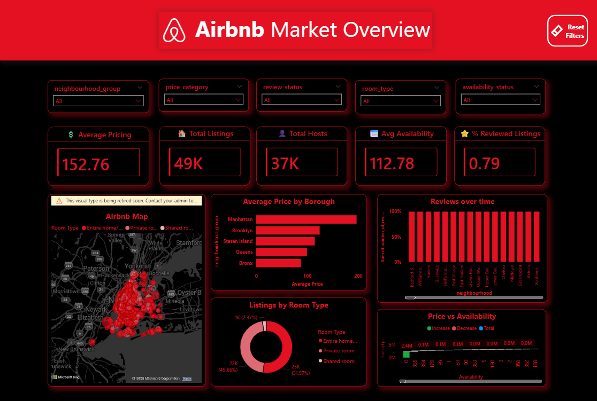

# Airbnb Market Analysis Dashboard

## Project Overview
This project presents an interactive analysis of Airbnb market trends using listing data and dashboard visuals. It focuses on pricing, room types, availability, host activity, and review patterns.

## Objective
The goal of this project is to understand Airbnb market behavior and identify useful insights that support better decision-making.

## Dashboard Preview

## Dataset
The dataset used in this project includes Airbnb listing information such as:
- Price
- Host details
- Room type
- Availability
- Reviews
- Neighbourhood group

## Key Insights
- Manhattan shows the highest average price.
- Entire home/apartment is the most common room type.
- Listings are concentrated in major boroughs.
- Availability and pricing show meaningful patterns.

## Tools Used
- Power BI
- Power Query
- DAX
- Data Cleaning
- Data Visualization

## Skills Demonstrated
- Data analysis
- Dashboard design
- KPI reporting
- Data transformation
- Business intelligence

## Project Files
- `Dataset/Airbnb_Listings.csv`
- `Screenshots/dashboard.png`

## Author
Deepak C R
Aspiring Data Analyst
